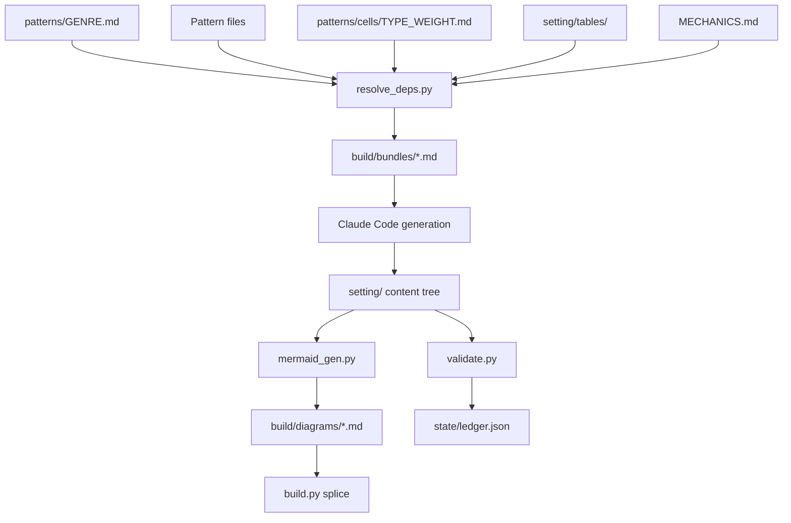

# Content Builder: OSR Adventure Setting Generator

**Status:** Ready to build. Move this file to `archive/` when all twelve steps pass the Editor workflow.

**Reader:** The developer running Claude Code in this repository. Written for that reader first. A second reader, the referee using the generated setting, is served by the output rather than by this file.

> **Plain language note:** This document follows ISO 24495-1:2023 and ISO 24495-3:2026. Its structure follows guidance derived from ISO/WD 24495-5, which is a working draft and not yet a published standard.

## Contents

- [1. What we are building](#1-what-we-are-building)
- [2. Governing decisions](#2-governing-decisions)
- [3. System neutrality and the mechanical interface](#3-system-neutrality-and-the-mechanical-interface)
- [4. Data model](#4-data-model)
- [5. Containers and the diagram layer](#5-containers-and-the-diagram-layer)
- [6. Repository structure](#6-repository-structure)
- [7. Pattern system](#7-pattern-system)
- [8. Phases, registers and visibility](#8-phases-registers-and-visibility)
- [9. Region type, difficulty and the nine cells](#9-region-type-difficulty-and-the-nine-cells)
- [10. Content rules that bind everywhere](#10-content-rules-that-bind-everywhere)
- [11. Steps and the progress ledger](#11-steps-and-the-progress-ledger)
- [12. Workflows and commands](#12-workflows-and-commands)
- [13. Tooling](#13-tooling)
- [14. Validation and the Editor](#14-validation-and-the-editor)
- [15. Where information lives](#15-where-information-lives)
- [16. Build order](#16-build-order)

## 1. What we are building

A repository that turns a genre brief into a complete Old School Renaissance (OSR) adventure setting, written as markdown files, by running a fixed sequence of pattern-driven generation steps in Claude Code.

**The core idea:** content flows downward in scale and is built in four passes. Scale runs Setting, then Region, then Location. Each scale runs the same four phases: Architect, Engineer, Builder, Decorator. A phase never skips ahead, so every later phase reads finished work rather than guessing at it.

**Architecture and data flow:**



**Four rules hold everywhere:**

- **Deterministic work runs in code.** Scaffolding, dice, validation, diagram derivation and dependency resolution never run as prose instructions.
- **Judgement runs in patterns.** Anything needing taste, theme or fiction runs through a pattern file and a language model.
- **Every generated file is reproducible.** A file can be deleted and rebuilt from its pattern, its dependencies and its recorded seed.
- **Every file carries current state only.** A superseded decision is rewritten, never annotated. Git holds the history.

## 2. Governing decisions

These are settled. Build to the decision rather than the alternative.

| Decision | Reason |
| :--- | :--- |
| **Markdown connection tables are the source of truth.** Every diagram at every tier is derived. | Tables diff cleanly and edit atomically. Hand-edited diagrams drift out of sync with the content tree. |
| **Codes are canonical in frontmatter and mirrored as a filename prefix.** | A code in the filename is greppable and sorts naturally. A code in frontmatter survives a rename. Validation asserts the two agree. |
| **Python for deterministic work, patterns for judgement.** | Language models produce biased, non-reproducible randomness and burn context on file scaffolding. |
| **Markdown body with YAML frontmatter.** | Frontmatter gives machine-readable fields for validation. The body keeps prose editable and reviewable. |
| **Subagents run Builder and Decorator only.** | Those phases write many files from a narrow slice of context. Architect and Engineer need the global view and stay in the main session. |
| **Dependencies live in the pattern's own frontmatter.** | Co-location keeps one source of truth. `DESIGN_PATTERNS.md` is generated from that frontmatter and never hand-maintained. |
| **A number with two consumers lives in `config/weights.yaml`.** A number only a writer reads stays inline in its pattern. | Where a pattern writes to a count and a script checks the same count, a second copy will drift. Where only the writer reads it, config is pointless indirection. |
| **The Architect may overwrite freely until a Builder pass has touched a file.** After that, regeneration is a booked step re-run. | Silent overwrite after content exists destroys work. A hand-patched file cannot survive its own regeneration. |
| **No file carries its own revision history in prose.** | Prose that supersedes earlier prose in the same file is how a document becomes unreadable. |

## 3. System neutrality and the mechanical interface

**The ruleset is the mold, not the scaffolding.** It is not in this repository and is never read by a pattern. The generated setting is system neutral prose that fits back around the rules when a referee drops it into their own campaign.

`MECHANICS.md` is the negative of that mold. It is one page, it lives in the repository, and it is the only file that maps a mechanical token to a system. Swapping it retargets the whole setting.

### 3.1. The neutrality rule

**Prose never states a mechanical value.** A feature reads as fiction and carries its mechanic beside it as a bracketed token. `{TEST: Sanity}` survives a system change. "Roll your Magic die" does not.

The token is referee-facing and never appears in player-facing text.

### 3.2. Token vocabulary

| Token | Carried by | Values |
| :--- | :--- | :--- |
| `{TEST: ...}` | Traps, hazards, forced dangers | Constitution, Sanity, Fate |
| `{WOUND: ...}` | Anything that can cause a Wound | Piercing, Crushing, Poison, Fire, Frost, Blast |
| `{CONDITION: name / effect / duration}` | Any Test of Fate | Free form, all three parts required |
| `{AD: n, mod}` | Every creature and NPC | Action Dice count, and a modifier from -2 to +6 |
| `{TYPE: ...}` | Every creature | Men, Humanoid, Beast, Fantasy, Undead, Construct, Horror, Wyrm, Fey, Fiend, Giant |
| `{VALUE: n cn}` and `{WT: n}` | Every treasure entry | Silver standard. 100 coins is one slot. |
| `{QUALITY: ...}` | Treasure and equipment | Cursed, Poor, Fine, Masterwork, Artifact |
| `{OUTCOME: ...}` | Every `T-PRC` entry | Success, Complication, Failure. Three lines, always all three. |

`validate.py` checks every token against this vocabulary and reports any bare mechanical value found in prose.

## 4. Data model

### 4.1. Entities

| Entity | Purpose | Relationships |
| :--- | :--- | :--- |
| **Setting** | Holds top-level identity, style and the container list for regions. | Owns all Tables, Containers and Regions. |
| **S table** | Setting-level and referee-facing. Directs content without appearing in a location. | Feeds T tables only. |
| **T table** | Connective. Supplies the concrete detail that appears in regions and locations. | Draws on S tables. Cited by Regions and Locations. |
| **Container** | A named grouping used by the diagram layer. Nothing more. | Holds Regions (setting level) or Locations (region level). |
| **Region** | A bounded area with a type, a difficulty die and a weight. | Belongs to the Setting and to one setting-level Container. Owns Locations. |
| **Location** | A single place a referee can run. | Belongs to a Region and to one region-level Container. |
| **Pattern** | The instruction set that generates one kind of output. | Declares dependencies on Tables, Regions or Locations. |

### 4.2. Codes

Codes are the primary key for every content file. They never change once written.

| Entity | Code format | Example | File |
| :--- | :--- | :--- | :--- |
| **Setting** | none, implicit | not applicable | `setting/setting.md` |
| **S table** | `S-XXX` | `S-TRU` | `tables/S-TRU-truths.md` |
| **T table** | `T-XXX` | `T-RUM` | `tables/T-RUM-rumours.md` |
| **Table entry** | `<table>-NN` | `T-RUM-07` | a row, not a file |
| **Container** | lowercase slug | `peak-1` | a list entry, not a file |
| **Region** | `R##` | `R03` | `R03-ashen-fen/region.md` |
| **Location** | `R##-L##` | `R03-L07` | `R03-L07-drowned-shrine.md` |

**Filename rule:** `<code>-<slug>.md`, where the slug is the lowercase, hyphenated name. `validate.py` fails when a filename prefix and a frontmatter code disagree.

**Containers carry no code namespace and no file.** They are slugs in a list, because a container exists to group nodes on a diagram and does nothing else.

### 4.3. Setting frontmatter

```yaml
---
name: The Ashen Reach
tags: [drowned, ashen, covenant]      # exactly three, thematic
seed: 4417
containers:                            # setting-level, group regions
  - id: the-reach
    name: The Ashen Reach
  - id: sunken-holds
    name: The Sunken Holds
schema_version: 1
---
```

### 4.4. Region frontmatter

```yaml
---
code: R03
name: Ashen Fen
tags: [sunken, hushed, watchful]      # exactly three, thematic
type: WILD                             # SAFE | WILD | DANGEROUS
difficulty: d8                         # d4 | d6 | d8 | d10 | d12, larger is easier
weight: medium                         # low | medium | high, sets location count
container: sunken-holds                # setting-level container
containers:                            # region-level, group locations
  - id: the-causeway
    name: The Causeway
  - id: drowned-tier
    name: The Drowned Tier
sources: [T-RUM-07, T-ARC-02]          # T table entry IDs, never S
schema_version: 1
---
```

### 4.5. Location frontmatter

```yaml
---
code: R03-L07
name: Drowned Shrine
tags: [flooded, votive, sinking]      # exactly three, thematic
region: R03
container: drowned-tier                # region-level container
cell: WILD_HIGH                        # region type + location weight
pattern: THRESHOLD                     # report only, never fails a check
sources: [T-LOR-11, T-BES-04]          # T table entry IDs, never S
schema_version: 1
---
```

**The `cell` token duplicates the parent region's type on purpose.** A disagreement between the two is a mis-tagged location, which is the error worth catching. `validate.py` asserts the prefix matches `region.type`.

### 4.6. Body sections and visibility

Every content block carries a visibility. Visibility decides who may read it and whether it survives to the finished playbook.

| Visibility | Survives? | Where it appears |
| :--- | :--- | :--- |
| **player** | Yes | Player Overview, and any text read aloud |
| **referee** | Yes | Referee Overview, Features detail, Fields, Exits, all tables, all tokens |
| **architect** | **No** | Working notes only, marked inline with `[[ ... ]]` |

**Architect visibility must not survive.** A note is struck when its content is absorbed. `validate.py` reports surviving notes during authoring and fails on them under `--final`.

| Scale | Required body headings |
| :--- | :--- |
| **Setting** | Overview, Style, Tables, Regions |
| **Region** | Overview, Fields, Tables, Connections, Diagram |
| **Location** | Player Overview, Referee Overview, Features, Exits |

### 4.7. Table catalogue

**S tables are setting-level and referee-facing.** No location may cite one. Four exist:

- **`S-HIS` History:** what happened, in order, and what it left behind.
- **`S-TRU` Truths:** the facts of the world that no in-world source states plainly.
- **`S-FAC` Factions:** who wants what, and what they will trade for it.
- **`S-AMB` Ambiance:** the sensory register of the setting as a whole.

**T tables are connective.** Twenty exist, and each is cited by at least one location.

| Code | Table | Decorated? | Code | Table | Decorated? |
| :--- | :--- | :--- | :--- | :--- | :--- |
| `T-LNG` | Language and root vocabulary | No | `T-PRC` | Procedures | No |
| `T-NAM` | Names | No | `T-ARC` | Architecture and Terrain | No |
| `T-LOR` | Lore (written works, statues, art) | **Yes** | `T-TRE` | Unique Treasures | **Yes** |
| `T-RUM` | Rumours | **Yes** | `T-TOM` | Magical Tomes | **Yes** |
| `T-UNQ` | Unanswered Questions | No | `T-HRD` | Hoards | **Yes** |
| `T-PUZ` | Puzzles | No | `T-TR1` | Treasure Table I | No |
| `T-KEY` | Keys and gating tokens | No | `T-TR2` | Treasure Table II | No |
| `T-HAZ` | Hazards | No | `T-TR3` | Treasure Table III | No |
| `T-BES` | Bestiary | **Yes** | `T-TR4` | Treasure Table IV | No |
| `T-CRE` | Named Creatures | **Yes** | `T-TR5` | Treasure Table V | No |

### 4.8. What earns a table

**The test:** content is a T table when it must be shared between locations, or when it is created before it is placed. Content failing both tests is local, and local content is generated by a pattern at the point of use.

Two things that look like tables and are not. Both live in `patterns/location/`:

- **Traps.** Almost always local and invented at the point of use. A trap construction that genuinely recurs across a region is recurring architecture, which is `T-ARC`.
- **Hoard composition.** A hoard's contents are assembled at its location by rolling the treasure tables. `T-HRD` holds the bespoke named hoards, which are shared by construction. Composing an ordinary one is a procedure.

**`T-KEY` exists because a gate and its key are two locations by definition.** Rods, tiles, spoken names, worn tokens and physical keys all live here, each row naming the location the key is found in and the location it opens. That pairing is what makes it checkable. Folded into `T-PUZ` or `T-ARC`, neither end could be validated.

**`T-LNG` is the root registry.** It holds the constructed-language guidance for the setting: the phoneme set, the compounding rules, and the recorded roots with their meanings. Every proper name decomposes into roots recorded there. New roots are proposed in a step's opening question batch, never coined in passing.

**`T-ARC` is not split by region type.** Its value is that the same stonework appears in a safe region and a dangerous one, because recognition is cheaper than explanation. It carries a `types` column marking which region types each entry suits, and an entry may suit all three.

**`T-PRC` is the one place a die roll may gate a result.** See section 10.2.

**Treasure Tables I through V are all tables**, of differing kinds and base values, from scavenged loot up to unique named items.

### 4.9. Table file format

```markdown
---
code: T-RUM
name: Rumours
kind: T
decorate: true                # artifact table, receives a Decorator pass
draws_on: [S-HIS, S-FAC]      # S codes, permitted in T tables only
schema_version: 1
---

| ID | Entry | True | Source faction |
| :--- | :--- | :--- | :--- |
| T-RUM-01 | The fen swallowed the bell, not the tower. | partly | Covenant |
```

**Artifact tables carry `decorate: true` and receive a Decorator pass at step 4.** An artifact entry is the thing itself: the lost journal's words, the rumour as spoken, the creature as described at the table. A row reading "the lost journal of a noble" is a stub a referee cannot hand to a player.

**Parameter tables stop at Builder.** Their rows are data a referee reads, and Entry register is the finished form.

## 5. Containers and the diagram layer

### 5.1. What a container is

A container is a named grouping that gives the diagram layer a tier to draw. It is a list entry, not a workflow. Nothing generates a container file, no pattern targets a container, and no phase writes container content.

- **Setting-level containers group regions.** Declared in `setting.md`. Each region names exactly one.
- **Region-level containers group locations.** Declared in `region.md`. Each location names exactly one.

### 5.2. The five tiers

| Tier | Diagram of | Shows | Edges |
| :--- | :--- | :--- | :--- |
| **1** | The setting | Setting-level containers | Binary, untyped |
| **2** | A setting-level container | The regions inside it | Binary, untyped |
| **3** | A region | The region-level containers inside it | Binary, untyped |
| **4** | A region-level container | The locations inside it | **Typed** |
| **5** | A location | Nothing. It is the leaf. | not applicable |

**Connection type is drawn at tier 4 and nowhere else.** Above tier 4, a connected pair gets one plain edge answering only whether they connect. Quantity and type are left out on purpose, because a setting diagram carrying twelve typed edges between two regions is unreadable and tells a referee nothing they can use.

**Where a tier-4 edge leaves its container,** the destination location is drawn on that diagram outside the container frame.

### 5.3. Derivation and splicing

**Every tier is derived.** `mermaid_gen.py` reads `connections.md` at setting and region scale and writes every diagram file into `build/diagrams/`. Nothing in the diagram layer is hand-authored.

**One diagram, one file.** Host files carry a marker and no mermaid of their own:

```
<!-- DIAGRAM: T4_R03_DROWNED_TIER.md -->
```

`build.py` splices each marker with the diagram file's contents. `validate.py` fails on any mermaid block outside `build/diagrams/`, and on any marker naming a file that does not exist.

## 6. Repository structure

```
.
├── SPEC.md                      # this file, archived when complete
├── CLAUDE.md                    # the non-negotiables, one page
├── MECHANICS.md                 # the token map, one page, swappable
├── DESIGN_PATTERNS.md           # generated router index, never hand-edited
├── STATE.md                     # generated human view of the ledger
├── EXTERNAL.md                  # the only backlog, capped at one page
├── config/
│   └── weights.yaml             # every number with two consumers
├── .github/
│   └── workflows/
│       └── checks.yml           # the same commands, on every push and pull request
├── .claude/
│   └── commands/
│       ├── generate.md
│       ├── update.md
│       ├── step.md
│       ├── edit.md
│       └── pattern.md
├── patterns/
│   ├── GENRE.md                 # thematic inspiration, capped at 2,000 words
│   ├── GENRE.example.md         # the pattern that writes GENRE.md
│   ├── setting/                 # architect, engineer, builder, decorator
│   ├── region/                  # same four
│   ├── location/                # same four, plus traps.md and hoards.md
│   ├── cells/
│   │   ├── SAFE_LOW.md          # nine files, a writer opens exactly one
│   │   ├── SAFE_MEDIUM.md
│   │   ├── SAFE_HIGH.md
│   │   ├── WILD_LOW.md
│   │   ├── WILD_MEDIUM.md
│   │   ├── WILD_HIGH.md
│   │   ├── DANGEROUS_LOW.md
│   │   ├── DANGEROUS_MEDIUM.md
│   │   └── DANGEROUS_HIGH.md
│   └── tables/                  # one per S and T table
├── setting/
│   ├── setting.md
│   ├── connections.md           # region-to-region edges
│   ├── tables/
│   └── regions/
│       └── R03-ashen-fen/
│           ├── region.md
│           ├── connections.md   # location-to-location edges, typed
│           └── locations/
│               └── R03-L07-drowned-shrine.md
├── tools/
│   ├── scaffold.py
│   ├── resolve_deps.py
│   ├── mermaid_gen.py
│   ├── validate.py
│   ├── build.py
│   ├── roll.py
│   ├── ledger.py
│   └── router.py
├── tests/
│   ├── harness.py               # a throwaway copy of the repo, and one tool run
│   ├── test_validate.py         # one case per mechanical check, proving it fires
│   └── test_tools.py            # scaffold, roll, ledger, and the scaffold round trip
├── state/
│   └── ledger.json              # canonical progress record
├── build/
│   ├── bundles/                 # resolved dependency bundles
│   ├── diagrams/                # every derived diagram, one per file
│   └── playbook.md              # spliced output
└── archive/
```

**Casing rule:** every directory is lowercase.

## 7. Pattern system

### 7.1. Pattern file shape

```markdown
---
id: location.builder.fields
target: location                        # setting | region | location | table
phase: builder                          # architect | engineer | builder | decorator
writes: [Features, Exits]               # body headings this pattern may touch
dependencies:
  - table:T-ARC
  - table:T-HAZ
  - table:T-KEY
  - region:${REGION_CODE}
  - container:${CONTAINER_ID}
  - cell:${CELL}
output_template: templates/location-fields.md
schema_version: 1
---

## Patterns
[One or more content patterns that satisfy the requirement.]

## Excluded patterns
[Content patterns that must not appear in this output.]

## Design questions
[Guiding questions that shape the output, asked before generation begins.]
```

### 7.2. The six pattern elements

| Element | Where it lives | Why there |
| :--- | :--- | :--- |
| **Target** | `target` and `phase` in frontmatter | The router needs it without reading prose. |
| **Dependencies** | `dependencies` in frontmatter | A script resolves it, so it must be structured. |
| **Output template** | `output_template` path in frontmatter | Templates are reused across patterns. |
| **Patterns** | `## Patterns` in the body | Judgement guidance, read by the model. |
| **Excluded patterns** | `## Excluded patterns` in the body | Judgement guidance, read by the model. |
| **Design questions** | `## Design questions` in the body | Asked as a batch before generation, per section 12.3. |

### 7.3. Genre and mechanics are implicit

**`GENRE.md` and `MECHANICS.md` are injected into every bundle by `resolve_deps.py`.** No pattern declares either.

Three constraints follow for `GENRE.md`:

- **It carries least common denominators only.** Anything true of one region belongs in that region, not here.
- **It is the only file permitted to reference works outside the content tree.** Influential authors, published modules, novels and films are named here and nowhere else, and they are named as a statement of the kind of play the setting supports. They are never a description of expected output, and no generated content imitates a named work.
- **It is capped at 2,000 words.** `resolve_deps.py` fails above the cap, because this file enters every subagent call and its size is a tax on all of them.

Freeze `GENRE.md` at the close of Milestone 2. Editing it afterwards is a step re-run of everything downstream.

### 7.4. Dependency selectors

`resolve_deps.py` understands seven selector forms and writes one bundle file per generation call.

| Selector | Resolves to |
| :--- | :--- |
| `table:S-XXX` | The whole S table file |
| `table:T-XXX` | The whole T table file |
| `region:R##` | That region's frontmatter and Overview |
| `container:<id>` | The container's member list and its tier-4 diagram |
| `siblings:location:R##` | Every sibling location's code, name, tags and cell only |
| `cell:<TYPE>_<WEIGHT>` | The one matching file from `patterns/cells/` |
| `config` | `config/weights.yaml` |

**Variable substitution:** `${REGION_CODE}`, `${LOCATION_CODE}`, `${CONTAINER_ID}` and `${CELL}` are filled from command arguments before resolution.

**The S boundary is mechanical.** `resolve_deps.py` refuses a `table:S-...` selector on any pattern whose target is `location`.

**Exactly one cell file resolves.** A `cell:` selector never returns two, so a writer never carries the other eight.

### 7.5. Why cells are separate files

Two reasons, and both are load-bearing.

- **Bundle size.** A phase pattern resolves into every bundle for that phase. Cell guidance held inside `patterns/location/builder.md` would put all nine cells into every location build, eight ninths of it wrong for that location.
- **Change rate.** Phase patterns are mechanism and go stable after Milestone 6. Cell files are the tuning surface and keep changing as the setting reveals what its cells actually are. Separation means a cell edit cannot break the pipeline.

### 7.6. Routing

`tools/router.py` scans every pattern's frontmatter and regenerates `DESIGN_PATTERNS.md` as a lookup table of target, phase and pattern ID. Run it after any pattern change. Never edit the file by hand.

## 8. Phases, registers and visibility

### 8.1. The four phases

| Phase | Job | May write | Runs in |
| :--- | :--- | :--- | :--- |
| **Architect** | Stub the file and write the headers. | Frontmatter, empty headings | Main session |
| **Engineer** | Write the connections: tables to regions and locations, and node to node. | `sources`, `container`, `connections.md`, `exits` | Main session |
| **Builder** | Write the fields and build content to the cell's discipline. | Features, Exits detail, Fields, all table rows | Subagent |
| **Decorator** | Write the prose in the register the section calls for. Decorate artifact tables. Strike architect notes. | Player Overview, Referee Overview, prose in Features, artifact table entries | Subagent |

**Overwrite discipline:** the Architect overwrites and creates fresh until a Builder pass has touched the file. After that, `ledger.json` marks the file built and the Architect refuses. Regeneration then runs as a booked step re-run, never as a hand-patch toward the new shape. A patched file cannot survive its own regeneration, which is the failure the rule exists to prevent.

### 8.2. Registers

| Register | Visibility | Voice | Test |
| :--- | :--- | :--- | :--- |
| **Player** | player | Lyrical, hinting at a wider world | Shows. Never states a conclusion the player should reach. Carries no token. |
| **Referee** | referee | Plain, bounded, spatially precise. Measurements and directions stated. | Enough to rule without instruction. |
| **Entry** | referee | Sentence fragments, 15 words or fewer, evocative | Reads well aloud from a table at speed. |
| **Architect** | architect | Anything | **Must not survive.** Struck when its content is absorbed. |

### 8.3. Subagent context contract

A Builder or Decorator subagent receives exactly three inputs and returns one output.

**Inputs:**

1. The pattern file.
2. The resolved bundle at `build/bundles/<pattern-id>-<target-code>.md`, which already contains the genre, the mechanics map, the one cell file and the config.
3. The current target file, including its stub.

**Output:** the complete replacement content of the target file, and nothing else.

**Prohibition:** a subagent never reads the `setting/` tree directly. If it needs context, the dependency selector was wrong and the pattern must change.

## 9. Region type, difficulty and the nine cells

### 9.1. Region type is the primary classifier

**Region type touches almost every pattern downstream of it.** It selects the cell file, decides which table the region carries, sets the units a location states, sets what the difficulty die measures, and constrains what a location must and may not declare. Read `region.type` before interpreting any other field on a region or on any location inside it.

### 9.2. What each type requires

| Type | Every location declares | Units it states | Region table |
| :--- | :--- | :--- | :--- |
| **SAFE** | A service and its cost, in coin, standing, obligation or risk. At least one refusal. No combat statistics. | Feet indoors, yards outdoors, miles on safe roads. Time in days. | Events, ascending |
| **WILD** | A non-visual approach cue at a distance the party can still turn back from. Terrain with a rate. | Yards and miles. Time in watches, six to a day. | Encounters, ascending |
| **DANGEROUS** | Reactions branching on named player actions. Exits with sensory cues. Gates with a priced answer. | Feet indoors, yards outside. Time in turns, six to an hour. | Dangers, **descending** |

**Every referee table is six rows and rolled on a d6.** Events, Encounters and Dangers all are. The difficulty die is a separate dial and never sizes a table.

**A Danger table counts down from 6 to 1**, each rung a step further into the region. It carries no mandated curve. The pattern supplies guidance and this is the sane default: atmosphere, then ominous signs, then hazards requiring a test, then traps and minor guardians, then danger avoidable only by care, then a forced encounter.

**Regions with outdoor extent also carry a six-row Weather table.**

### 9.3. Difficulty

**Every die from `d4` to `d12` is valid in every region type. A larger die is easier.** `d8` is average. `d10` and `d12` ease narrative success. `d6` and `d4` are progressively harder, and `d4` is the hardest region in the setting.

| Type | What the die measures |
| :--- | :--- |
| **SAFE** | The size of the settlement, and the availability of goods, resources and services |
| **WILD** | The treacherousness of the terrain, and the cost of leaving the road |
| **DANGEROUS** | The evil of the place, and how readily traps and environmental hazards find the party |

### 9.4. The nine cells

**The cell is the region's type crossed with the location's weight.** It is written on the location as one token and selects exactly one file from `patterns/cells/`.

|  | `LOW` | `MEDIUM` | `HIGH` |
| :--- | :--- | :--- | :--- |
| **`SAFE`** | Thin by nature. A building with one door. | The body of a settlement. | The people and places worth returning for. |
| **`WILD`** | Dissolved into procedure rather than keyed. | The body of a road. | The arrival, and the thing worth leaving it for. |
| **`DANGEROUS`** | The bulk of the module, carried by format. | The working body of a level. | The region's landmarks. |

**The cells are unequal on purpose and are never padded to match.** Each cell file states its own design principles: what belongs in it, where the boundary to the next cell falls, the form its locations take, and worked examples. The cells feel different because they are written to different disciplines, not because a ratio moved.

### 9.5. Region weight sets location count

Weight is a count, not a ratio. A ratio cannot express "at least four landmarks", because in a small region it rounds to zero.

| Weight | Locations | Minimum `HIGH` | Character of the rest |
| :--- | :--- | :--- | :--- |
| **low** | 12 to 20 | 2 | Mostly `MEDIUM`. Little navigation, because there is little to navigate. |
| **medium** | 20 to 40 | 3 | A `MEDIUM` body with `LOW` connective ground between landmarks. |
| **high** | 40 to 60 | 4 | A real mix. `MEDIUM` rooms with something to do, and `LOW` rooms to navigate that should read as questionable rather than settled. |

**Two numbers are checked and no more:** the location count sits in the band, and the `HIGH` count meets the minimum. Both live in `config/weights.yaml`. The `MEDIUM` to `LOW` split is cell-file guidance and is never checked, because whether a `LOW` room appears empty or is empty is a judgement.

### 9.6. Tuning

**Section 9 is written to be changed.** Adjust the bands in `config/weights.yaml` and the design principles in the nine cell files. Never write a checked count into a cell file. Cite the config key by name instead, so one edit moves the whole system.

## 10. Content rules that bind everywhere

These bind across all nine cells and are stated once, here.

### 10.1. The three layers

| Layer | Written in | Reached by |
| :--- | :--- | :--- |
| **Landmark** | The Player Overview | Arriving and looking |
| **Hidden** | A feature's name and its opening line | Asking about a thing named in the Overview, or spending time on it |
| **Secret** | Inside that same feature's entry | A named physical action |

**Every bolded noun in a Player Overview appears below as a feature.** The check runs one way only. A feature need not have a bolded noun above it, but a bolded noun without a feature is a promise the referee cannot keep at the table.

**A note on the word "secret".** A ruleset's search procedure may return what it calls secrets. Those are this system's **Hidden** layer. This system's **Secret** layer is gated on a physical action and is never what a search returns. Keep the two apart when writing, because conflating them turns a gate into a roll.

### 10.2. Secrets, clues and gates

**A secret** is content not reachable by arriving and looking. It is gated on a named physical action: standing somewhere, clearing something, opening something, speaking a name, looking back.

**A clue** is any findable thing making a secret's existence or its gate inferable. Two kinds are valid and both count:

- **Proximate clue, in the same location.** The subtle change in the artwork disguising the door is a proper clue and needs nothing outside the room.
- **Distributed clue, reached through the tables.** A `T-LOR` entry reinforcing an `S-HIS` item is a clue. This is how S table content reaches a player: through a T table, never directly.

**Every secret carries at least one clue.** A secret with no clue is a die roll wearing a costume.

**No secret and no clue resolves on a roll.** Time spent searching is a separate matter, and what a roll adjudicates there is what the time costs, not whether the thing is found. Content therefore never writes a discovery as roll-gated, and the referee's adjudication is left free. The one exception is `T-PRC`, where a die roll tied to a stated `{OUTCOME: ...}` is what a procedure entry is for.

### 10.3. Gates and answers

**Every gate has an answer that is not the gate, and the answer is priced.** Not a second door. A longer road, a darker road, or a road watched by something worse. Both branches are costed and the content never says which is the mistake.

**Where a bypass is cheaper in time, its cost is stated as what the party arrives without:** unpractised, unmet, or burning light they will want later.

**Where a gate opens to a key, both ends are recorded in `T-KEY`.**

### 10.4. Negative space

**Locations may be thin, and thin is not failure.** A region where everything is interesting has no landmarks.

**A field may be empty. State the nil.** Write `None` with a brief reason. An omitted field is ambiguous, because a reader cannot tell whether the author decided or forgot. Never pad.

### 10.5. Trope and defiance

**Trope is free structure.** Naming a trope imports a whole shape at a cost of three words, and the saved budget goes into the detail that could only be this instance.

**Defiance is funded by convention held elsewhere.** Content that subverts constantly teaches players that nothing means what it looks like, and then every clue placed anywhere goes unread. Each deliberate defiance names the straight instances funding it, by code, in the Referee Overview.

### 10.6. Inline marks

Three marks, and only three. Each carries one meaning.

| Mark | Meaning | Survives? |
| :--- | :--- | :--- |
| `(SECTION, key)` | A reference to a table entry, such as `(BESTIARY, Goblin)`. Becomes a link in the built playbook. | Yes |
| `->` | A connection pointer inside a feature, naming the location it leads to. | Yes |
| `[[ ... ]]` | An editorial note in architect register. | **No** |

**`->` appears only in a feature's connection pointer.** It is what the diagram derivation reads, so any other use corrupts the graph.

Mechanical tokens are a separate layer and are defined in section 3.2.

## 11. Steps and the progress ledger

### 11.1. The twelve steps

Run in order. A step may not start until the previous step passes validation.

| Step | Name | Phase | Writes |
| :--- | :--- | :--- | :--- |
| 1 | Setting headers | Architect | `setting.md` stub, all table stubs |
| 2 | Setting connections | Engineer | Setting containers, `setting/connections.md` |
| 3 | Setting fields | Builder | All S and T table rows |
| 4 | Setting prose | Decorator | Setting Overview and Style, all artifact table entries |
| 5 | Region headers | Architect | One `region.md` stub per region, with weight and difficulty set |
| 6 | Region connections | Engineer | Region containers, `sources`, region `connections.md` |
| 7 | Region fields | Builder | Region Fields, region table, Weather table where applicable |
| 8 | Region prose | Decorator | Region Overview |
| 9 | Location headers | Architect | One location stub per location, with its `cell` assigned |
| 10 | Location connections | Engineer | Location `sources`, `container` and typed exits |
| 11 | Location fields | Builder | Location Features and Exits |
| 12 | Location prose | Decorator | Player Overview and Referee Overview, architect notes struck |

**Step 11 runs in three passes: `HIGH`, then `MEDIUM`, then `LOW`.** Landmarks are written first because the thinner cells are written against them. A `LOW` location written before its region's landmarks exist has nothing to be thin in contrast to.

### 11.2. Ledger format

`state/ledger.json` is canonical. `STATE.md` is generated from it and holds nothing else.

```json
{
  "schema_version": 1,
  "seed": 4417,
  "current_step": 11,
  "current_pass": "HIGH",
  "steps": {
    "10": {"status": "complete", "targets": 34, "completed_at": "2026-08-24T18:02:11Z"},
    "11": {"status": "in_progress", "done": ["R01-L01"], "pending": ["R01-L03"]}
  },
  "built": ["R01-L01", "R01-L02"]
}
```

**`built` is the overwrite guard.** The Architect refuses any target listed there, per section 8.1.

**Resumability:** `/step 11` reads the ledger, skips every target in `done`, and continues. That is how a step survives the end of a conversation.

## 12. Workflows and commands

Five workflows. Each maps to one slash command in `.claude/commands/`.

### 12.1. Content generation

**Command:** `/generate <pattern-id> [--target <code>]`

Generates content in the pattern's format and prints it to the conversation without writing to the content tree. Use it to sample a pattern before committing to it.

### 12.2. Content update

**Command:** `/update <pattern-id> --target <code>`

1. **Resolve dependencies:** Run `python tools/resolve_deps.py --pattern <id> --target <code>`.
2. **Ask the design questions** from the pattern, as one batch. Wait for answers.
3. **Generate:** Pass the pattern, bundle and current file to a subagent.
4. **Write:** Replace the target file with the returned content.
5. **Validate:** Run `python tools/validate.py --target <code>`.

### 12.3. Execute step

**Command:** `/step <n>`

**Every step opens with a question batch and generates nothing until it is answered.** The batch is drawn from the `## Design questions` of the patterns the step will run, plus any root-vocabulary proposals for `T-LNG`. Questions are batched whole, with genuine alternatives rather than only the conservative option. This is what prevents a large generation being thrown away and rewritten.

1. **Ask the batch.** Wait for answers. Write nothing yet.
2. **Read the ledger** and build the pending target list.
3. **Resolve one bundle per target.**
4. **Dispatch subagents**, at most four at a time, one target each.
5. **Write and validate** each returned file.
6. **Record progress** after every target, never only at the end.

**Batch unit:** one region per conversation at region and location scale. That is the largest unit fitting comfortably in context alongside its bundles.

### 12.4. Editor

**Command:** `/edit <scope>`

Runs three checks in order and stops at the first failing tier.

1. **Mechanical checks:** `python tools/validate.py --scope <scope>`.
2. **Judgement checks:** an agentic pass against the rubric in section 14.2.
3. **Explicit user feedback:** present findings as a table and wait for a decision before writing anything.

### 12.5. Pattern update

**Command:** `/pattern <request>`

Changes pattern files under user guidance, with the `setting/` tree excluded from context so existing generated content cannot bias framework decisions. After any change, run `python tools/router.py` to regenerate `DESIGN_PATTERNS.md`.

**A pattern change invalidating existing content is a step re-run,** booked as its own pass. It is never a hand-patch of the affected files.

## 13. Tooling

Python 3.11 or later. Standard library plus `pyyaml` only. Every script is a command line interface (CLI) exiting non-zero on failure.

| Script | Purpose |
| :--- | :--- |
| `tools/scaffold.py` | Create file stubs, frontmatter and empty headings for a scale. |
| `tools/resolve_deps.py` | Expand selectors into one bundle, inject genre, mechanics, cell and config, enforce the S boundary and the genre cap. |
| `tools/mermaid_gen.py` | Derive every diagram tier from the `connections.md` tables into `build/diagrams/`. |
| `tools/validate.py` | Run the mechanical checks in section 14.1 with severity handling. |
| `tools/build.py` | Splice diagram markers and assemble `build/playbook.md`. |
| `tools/roll.py` | Seeded dice and weighted table rolls. All randomness passes through here. |
| `tools/ledger.py` | Read and write `state/ledger.json`, regenerate `STATE.md`. |
| `tools/router.py` | Scan pattern frontmatter and regenerate `DESIGN_PATTERNS.md`. |

**Seeding:** `roll.py` derives its seed from the setting seed and the target code, so the same target rolls the same result on a rebuild.

## 14. Validation and the Editor

### 14.1. Mechanical checks

Each check has a severity. `ERROR` fails the run. `REPORT` prints and continues. `--final` promotes every `REPORT` to `ERROR` and is step 12's acceptance test.

| ID | Check | Severity |
| :--- | :--- | :--- |
| **M1** | Code uniqueness across the corpus. | ERROR |
| **M2** | Filename prefix matches the frontmatter code. | ERROR |
| **M3** | Exactly three tags on every Setting, Region and Location. | ERROR |
| **M4** | Required frontmatter keys present and correctly typed. | ERROR |
| **M5** | Location `cell` prefix matches its region's `type`. | ERROR |
| **M6** | Region location count sits in its weight band, and the `HIGH` count meets the minimum. | ERROR |
| **M7** | Every `exits.to` code resolves to a real location. | ERROR |
| **M8** | Every exit has a reverse exit unless typed one-way. | ERROR |
| **M9** | No orphan locations. Every location is reachable. | ERROR |
| **M10** | Every region and location belongs to exactly one container at its level. | ERROR |
| **M11** | Derived diagrams match what `mermaid_gen.py` re-derives from the tables. | ERROR |
| **M12** | Typed edges appear at tier 4 only. Tiers 1 to 3 carry binary edges. | ERROR |
| **M13** | Every splice marker resolves. No mermaid block outside `build/diagrams/`. | ERROR |
| **M14** | No location `sources` entry begins with `S-`. | ERROR |
| **M15** | Every `T` table is cited by at least one location. | ERROR |
| **M16** | Every `sources` ID and every `(SECTION, key)` token resolves. | ERROR |
| **M17** | Every bolded noun in a Player Overview has a matching feature. One-way. | ERROR |
| **M18** | Every proper name decomposes into roots recorded in `T-LNG`. | ERROR |
| **M19** | Region table matches region type, carries six rows, and Dangers descend. | ERROR |
| **M20** | Every `T-KEY` row names a key location and a gate location, and both exist. | ERROR |
| **M21** | Every mechanical token matches the vocabulary in `MECHANICS.md`. | ERROR |
| **M22** | Required fields are present, with `None` and a reason allowed. | ERROR |
| **M23** | `->` appears only inside a feature connection pointer. | ERROR |
| **M24** | No bare mechanical value appears in prose, and no token appears in player-facing text. | REPORT |
| **M25** | No `[[ ... ]]` note survives in a file the Decorator has closed. | REPORT |

**Every check carries a negative case** in `tests/test_validate.py` that breaks
one thing and asserts the check reports it at the severity above. A check with
no case cannot be told apart from a check that no longer runs, so a new or
changed check arrives with its case.

### 14.2. Judgement rubric

Read by a person and by Claude, one scope at a time. A failure here is an argument rather than a fact.

- **J1 Demotion.** Anything true of one named location is pushed down into that location. Split the field into clauses first, name a destination for each, write the destination before cutting the clause, then re-read the original against the finished locations.
- **J2 Clue chain.** Every secret carries at least one clue, proximate or distributed. No clue and no gate resolves on a roll outside `T-PRC`.
- **J3 Gates.** Every gate has an answer that is not the gate, and the answer is priced. More than one route reaches most places.
- **J4 Show don't tell.** Player-facing text shows and never states a conclusion the player should reach. Referee text may state facts plainly, because that is its job.
- **J5 Register and visibility.** Each block is written in the register its visibility assigns. No architect voice survives.
- **J6 Excluded patterns.** The content is free of every pattern its cell file excludes.
- **J7 Negative space.** Thin locations are thin because the region needed breathing room, not because nobody wrote them.
- **J8 Trope funding.** Each deliberate defiance names the straight instances funding it.
- **J9 Artifact completeness.** Every decorated table entry is the thing itself and not a description of it. A referee can read it to a player as written.
- **J10 Referee usability.** A referee can run this location without inventing a missing fact.

### 14.3. Findings format

The Editor reports findings as a table with a header row: the code, the check, and the suggested fix. It never writes a fix without explicit approval.

## 15. Where information lives

**There is no open-questions register and no decisions log.** Both accumulate, both grow their own revision history in prose, and both become a parallel copy of the project that drifts out of sync with the content tree. The procedural generation and the connected tables exist to make them unnecessary.

| Information | Where it goes | Placed by |
| :--- | :--- | :--- |
| **A build-time question** | The step's opening question batch, answered before generation | `/step` |
| **A deliberate in-fiction open thread** | A `T-UNQ` row | Step 3 |
| **A ratified production rule** | The pattern file or the cell file that enforces it | `/pattern` |
| **A checked number** | `config/weights.yaml`, and nowhere else | `/pattern` |
| **A number only a writer reads** | Inline in the pattern that uses it | `/pattern` |
| **A mechanical term** | `MECHANICS.md`, cited in content as a token | `/pattern` |
| **A proposed name root** | A `T-LNG` row | Step 3, or a later question batch |
| **A gate and its key** | A `T-KEY` row, both ends named | Step 10 |
| **A cross-region thread** | The container's tier-2 diagram and the setting `connections.md` | Step 2 |
| **A fact true of one location** | That location's file, by demotion | J1 |
| **A change to how content is produced** | The pattern, followed by a booked step re-run | `/pattern` |
| **A dependency outside this repository** | `EXTERNAL.md`, capped at one page | Any pass |

**Three discipline rules keep this from decaying:**

- **Never invent an answer to an open item.** Stop and ask. An invented answer becomes canon silently and no check will catch it.
- **Rewrite, never annotate.** Output always carries current state. A file saying one thing and superseding itself lower down is unreadable, and git already holds the history.
- **Every file has a stated purpose and holds nothing else.** `STATE.md` is a generated view. `CLAUDE.md` and `MECHANICS.md` are one page each. `GENRE.md` is capped at 2,000 words. A file starting to absorb neighbouring content is the drift, showing itself early.

## 16. Build order

Build the framework before the content. Each milestone ends in a working, testable state.

1. **Milestone 1, foundation.** Write `scaffold.py`, `validate.py` with severity, `roll.py` and `ledger.py`. Write `config/weights.yaml`, `CLAUDE.md` and `MECHANICS.md`. Hand-write one region and two locations to test against.
2. **Milestone 2, routing and genre.** Write `resolve_deps.py` and `router.py`. Write `GENRE.example.md`, generate `GENRE.md`, then freeze it.
3. **Milestone 3, the nine cells.** Write all nine files in `patterns/cells/`. **Budget the most time here.** These files are the highest-value artifacts in the repository, nothing good can be generated before they exist, and thin cell files were the specific failure this project is being rebuilt to fix. Do not start them until Milestone 2 is frozen, and do not shorten them to reach Milestone 4.
4. **Milestone 4, setting scale.** Write the four setting patterns and the twenty-four table patterns. Run steps 1 to 4, including the artifact decoration pass.
5. **Milestone 5, region scale and diagrams.** Write the four region patterns, `mermaid_gen.py` and `build.py`. Run steps 5 to 8. The diagram layer must work end to end before any location is written.
6. **Milestone 6, location scale.** Write the four location patterns plus `traps.md` and `hoards.md`, and the subagent dispatch. Run steps 9 to 12, with step 11 in `HIGH`, `MEDIUM`, `LOW` order.
7. **Milestone 7, editor.** Write the judgement rubric pass and the `/edit` command. Run `validate.py --final` over the whole setting.
