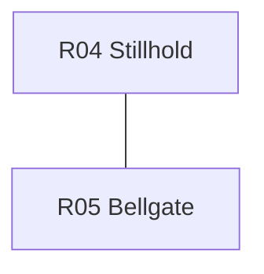

```mermaid
flowchart TD
%% Tier 2. Container covenant-ground: the regions inside it, binary edges.
%% Derived by tools/mermaid_gen.py. Do not edit.
    R04["R04 Stillhold"]
    R05["R05 Bellgate"]
    R04 --- R05
```
