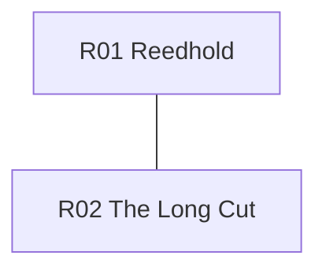

```mermaid
flowchart TD
%% Tier 2. Container cut-water: the regions inside it, binary edges.
%% Derived by tools/mermaid_gen.py. Do not edit.
    R01["R01 Reedhold"]
    R02["R02 The Long Cut"]
    R01 --- R02
```
