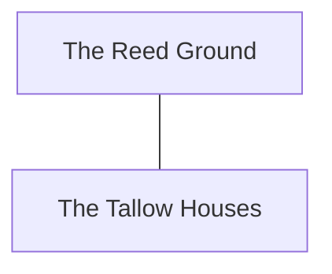

```mermaid
flowchart TD
%% Tier 3. Region R01: the region-level containers inside it, binary edges.
%% Derived by tools/mermaid_gen.py. Do not edit.
    C_THE_TALLOW_HOUSES["The Tallow Houses"]
    C_THE_REED_GROUND["The Reed Ground"]
    C_THE_REED_GROUND --- C_THE_TALLOW_HOUSES
```
