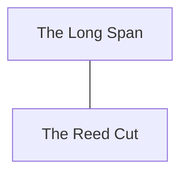

```mermaid
flowchart TD
%% Tier 3. Region R02: the region-level containers inside it, binary edges.
%% Derived by tools/mermaid_gen.py. Do not edit.
    C_THE_LONG_SPAN["The Long Span"]
    C_THE_REED_CUT["The Reed Cut"]
    C_THE_LONG_SPAN --- C_THE_REED_CUT
```
