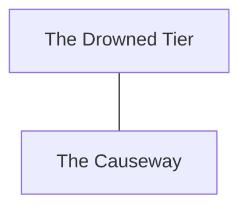

```mermaid
flowchart TD
%% Tier 3. Region R03: the region-level containers inside it, binary edges.
%% Derived by tools/mermaid_gen.py. Do not edit.
    C_THE_CAUSEWAY["The Causeway"]
    C_DROWNED_TIER["The Drowned Tier"]
    C_DROWNED_TIER --- C_THE_CAUSEWAY
```
