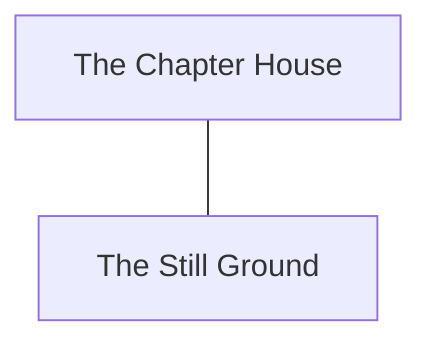

```mermaid
flowchart TD
%% Tier 3. Region R04: the region-level containers inside it, binary edges.
%% Derived by tools/mermaid_gen.py. Do not edit.
    C_THE_CHAPTER_HOUSE["The Chapter House"]
    C_THE_STILL_GROUND["The Still Ground"]
    C_THE_CHAPTER_HOUSE --- C_THE_STILL_GROUND
```
