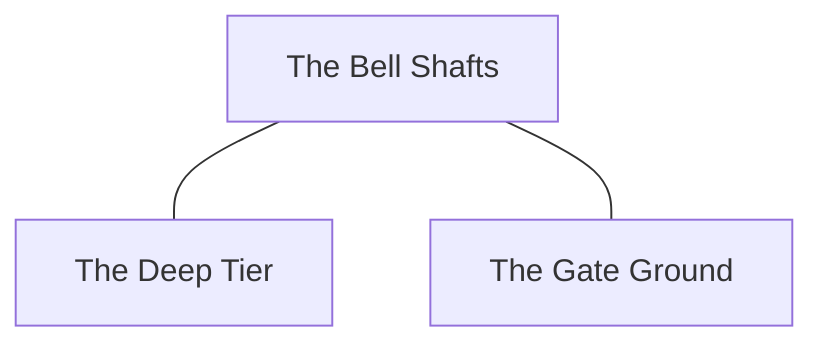

```mermaid
flowchart TD
%% Tier 3. Region R05: the region-level containers inside it, binary edges.
%% Derived by tools/mermaid_gen.py. Do not edit.
    C_THE_GATE_GROUND["The Gate Ground"]
    C_THE_BELL_SHAFTS["The Bell Shafts"]
    C_THE_DEEP_TIER["The Deep Tier"]
    C_THE_BELL_SHAFTS --- C_THE_DEEP_TIER
    C_THE_BELL_SHAFTS --- C_THE_GATE_GROUND
```
