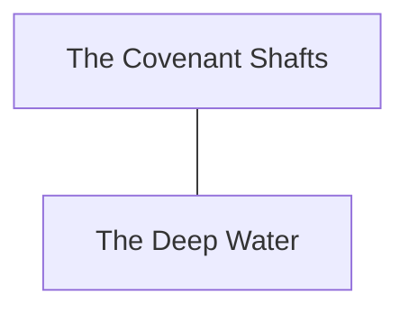

```mermaid
flowchart TD
%% Tier 3. Region R06: the region-level containers inside it, binary edges.
%% Derived by tools/mermaid_gen.py. Do not edit.
    C_THE_COVENANT_SHAFTS["The Covenant Shafts"]
    C_THE_DEEP_WATER["The Deep Water"]
    C_THE_COVENANT_SHAFTS --- C_THE_DEEP_WATER
```
