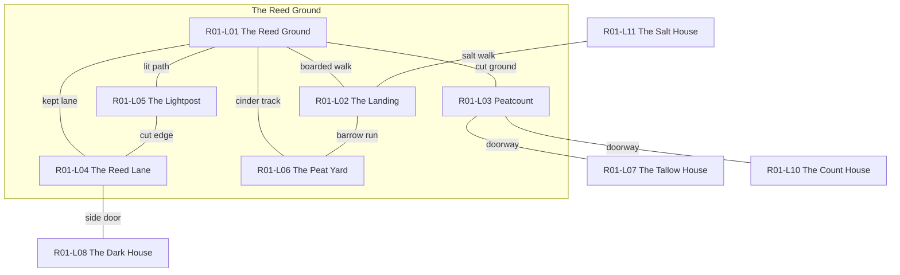

```mermaid
flowchart TD
%% Tier 4. Container the-reed-ground of R01: its locations, typed edges, and the destinations they reach outside it.
%% Derived by tools/mermaid_gen.py. Do not edit.
    subgraph THE_REED_GROUND["The Reed Ground"]
        R01_L01["R01-L01 The Reed Ground"]
        R01_L02["R01-L02 The Landing"]
        R01_L03["R01-L03 Peatcount"]
        R01_L04["R01-L04 The Reed Lane"]
        R01_L05["R01-L05 The Lightpost"]
        R01_L06["R01-L06 The Peat Yard"]
    end
    R01_L07["R01-L07 The Tallow House"]
    R01_L08["R01-L08 The Dark House"]
    R01_L10["R01-L10 The Count House"]
    R01_L11["R01-L11 The Salt House"]
    R01_L01 ---|boarded walk| R01_L02
    R01_L01 ---|cut ground| R01_L03
    R01_L01 ---|kept lane| R01_L04
    R01_L01 ---|lit path| R01_L05
    R01_L01 ---|cinder track| R01_L06
    R01_L02 ---|barrow run| R01_L06
    R01_L03 ---|doorway| R01_L07
    R01_L03 ---|doorway| R01_L10
    R01_L04 ---|side door| R01_L08
    R01_L05 ---|cut edge| R01_L04
    R01_L11 ---|salt walk| R01_L02
```
