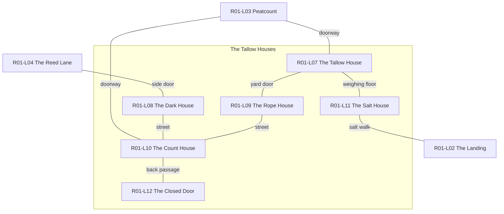

```mermaid
flowchart TD
%% Tier 4. Container the-tallow-houses of R01: its locations, typed edges, and the destinations they reach outside it.
%% Derived by tools/mermaid_gen.py. Do not edit.
    subgraph THE_TALLOW_HOUSES["The Tallow Houses"]
        R01_L07["R01-L07 The Tallow House"]
        R01_L08["R01-L08 The Dark House"]
        R01_L09["R01-L09 The Rope House"]
        R01_L10["R01-L10 The Count House"]
        R01_L11["R01-L11 The Salt House"]
        R01_L12["R01-L12 The Closed Door"]
    end
    R01_L02["R01-L02 The Landing"]
    R01_L03["R01-L03 Peatcount"]
    R01_L04["R01-L04 The Reed Lane"]
    R01_L03 ---|doorway| R01_L07
    R01_L03 ---|doorway| R01_L10
    R01_L04 ---|side door| R01_L08
    R01_L07 ---|yard door| R01_L09
    R01_L07 ---|weighing floor| R01_L11
    R01_L08 ---|street| R01_L10
    R01_L09 ---|street| R01_L10
    R01_L10 ---|back passage| R01_L12
    R01_L11 ---|salt walk| R01_L02
```
