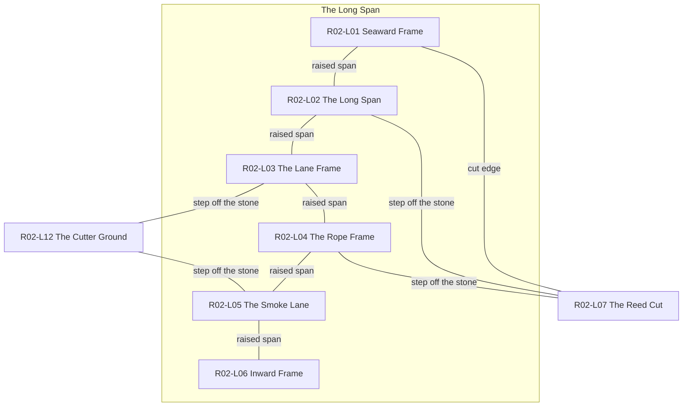

```mermaid
flowchart TD
%% Tier 4. Container the-long-span of R02: its locations, typed edges, and the destinations they reach outside it.
%% Derived by tools/mermaid_gen.py. Do not edit.
    subgraph THE_LONG_SPAN["The Long Span"]
        R02_L01["R02-L01 Seaward Frame"]
        R02_L02["R02-L02 The Long Span"]
        R02_L03["R02-L03 The Lane Frame"]
        R02_L04["R02-L04 The Rope Frame"]
        R02_L05["R02-L05 The Smoke Lane"]
        R02_L06["R02-L06 Inward Frame"]
    end
    R02_L07["R02-L07 The Reed Cut"]
    R02_L12["R02-L12 The Cutter Ground"]
    R02_L01 ---|raised span| R02_L02
    R02_L01 ---|cut edge| R02_L07
    R02_L02 ---|raised span| R02_L03
    R02_L02 ---|step off the stone| R02_L07
    R02_L03 ---|raised span| R02_L04
    R02_L03 ---|step off the stone| R02_L12
    R02_L04 ---|raised span| R02_L05
    R02_L04 ---|step off the stone| R02_L07
    R02_L05 ---|raised span| R02_L06
    R02_L12 ---|step off the stone| R02_L05
```
