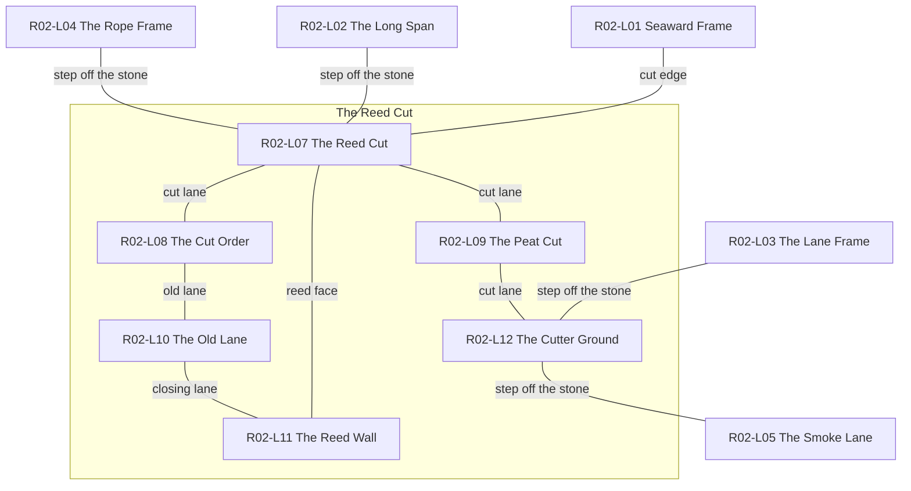

```mermaid
flowchart TD
%% Tier 4. Container the-reed-cut of R02: its locations, typed edges, and the destinations they reach outside it.
%% Derived by tools/mermaid_gen.py. Do not edit.
    subgraph THE_REED_CUT["The Reed Cut"]
        R02_L07["R02-L07 The Reed Cut"]
        R02_L08["R02-L08 The Cut Order"]
        R02_L09["R02-L09 The Peat Cut"]
        R02_L10["R02-L10 The Old Lane"]
        R02_L11["R02-L11 The Reed Wall"]
        R02_L12["R02-L12 The Cutter Ground"]
    end
    R02_L01["R02-L01 Seaward Frame"]
    R02_L02["R02-L02 The Long Span"]
    R02_L03["R02-L03 The Lane Frame"]
    R02_L04["R02-L04 The Rope Frame"]
    R02_L05["R02-L05 The Smoke Lane"]
    R02_L01 ---|cut edge| R02_L07
    R02_L02 ---|step off the stone| R02_L07
    R02_L03 ---|step off the stone| R02_L12
    R02_L04 ---|step off the stone| R02_L07
    R02_L07 ---|cut lane| R02_L08
    R02_L07 ---|cut lane| R02_L09
    R02_L07 ---|reed face| R02_L11
    R02_L08 ---|old lane| R02_L10
    R02_L09 ---|cut lane| R02_L12
    R02_L10 ---|closing lane| R02_L11
    R02_L12 ---|step off the stone| R02_L05
```
