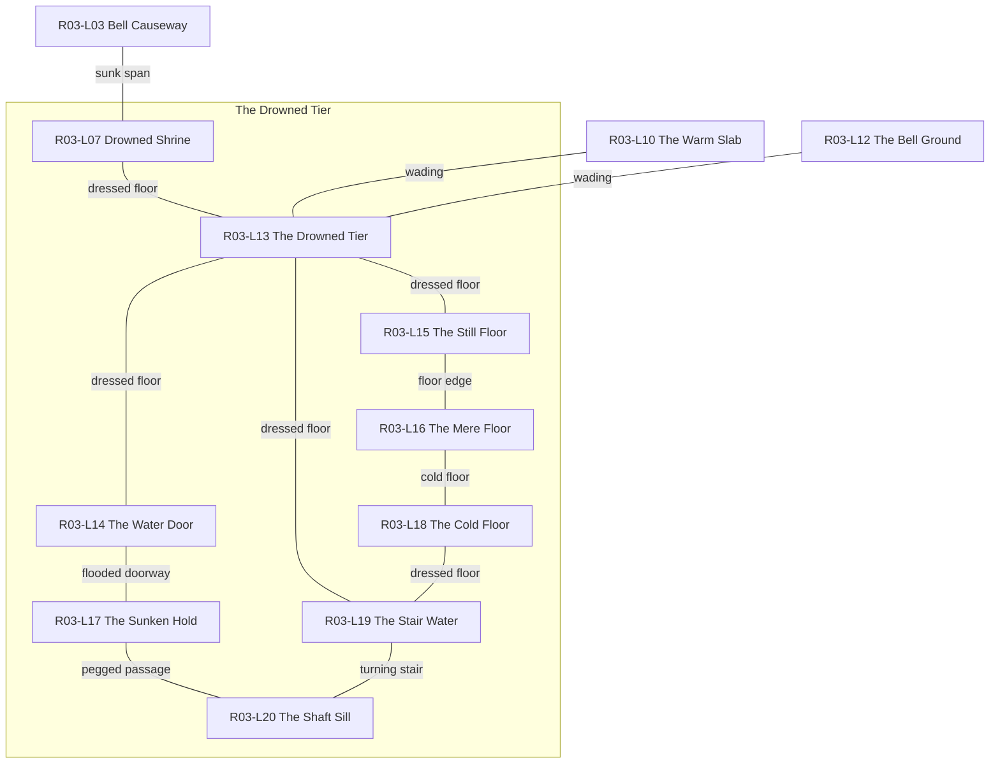

```mermaid
flowchart TD
%% Tier 4. Container drowned-tier of R03: its locations, typed edges, and the destinations they reach outside it.
%% Derived by tools/mermaid_gen.py. Do not edit.
    subgraph DROWNED_TIER["The Drowned Tier"]
        R03_L07["R03-L07 Drowned Shrine"]
        R03_L13["R03-L13 The Drowned Tier"]
        R03_L14["R03-L14 The Water Door"]
        R03_L15["R03-L15 The Still Floor"]
        R03_L16["R03-L16 The Mere Floor"]
        R03_L17["R03-L17 The Sunken Hold"]
        R03_L18["R03-L18 The Cold Floor"]
        R03_L19["R03-L19 The Stair Water"]
        R03_L20["R03-L20 The Shaft Sill"]
    end
    R03_L03["R03-L03 Bell Causeway"]
    R03_L10["R03-L10 The Warm Slab"]
    R03_L12["R03-L12 The Bell Ground"]
    R03_L03 ---|sunk span| R03_L07
    R03_L07 ---|dressed floor| R03_L13
    R03_L10 ---|wading| R03_L13
    R03_L12 ---|wading| R03_L13
    R03_L13 ---|dressed floor| R03_L14
    R03_L13 ---|dressed floor| R03_L15
    R03_L13 ---|dressed floor| R03_L19
    R03_L14 ---|flooded doorway| R03_L17
    R03_L15 ---|floor edge| R03_L16
    R03_L16 ---|cold floor| R03_L18
    R03_L17 ---|pegged passage| R03_L20
    R03_L18 ---|dressed floor| R03_L19
    R03_L19 ---|turning stair| R03_L20
```
