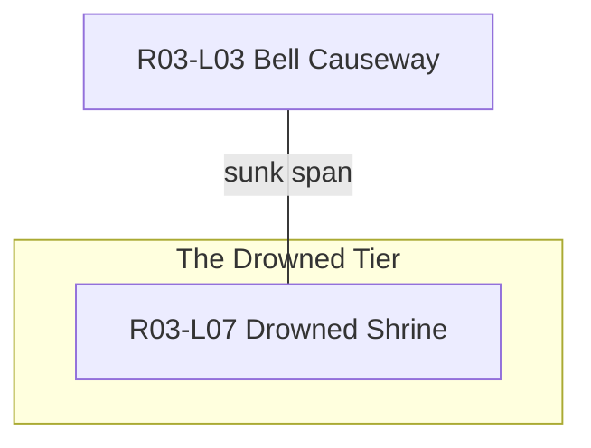

```mermaid
flowchart TD
%% Tier 4. Container drowned-tier of R03: its locations, typed edges, and the destinations they reach outside it.
%% Derived by tools/mermaid_gen.py. Do not edit.
    subgraph DROWNED_TIER["The Drowned Tier"]
        R03_L07["R03-L07 Drowned Shrine"]
    end
    R03_L03["R03-L03 Bell Causeway"]
    R03_L03 ---|sunk span| R03_L07
```
