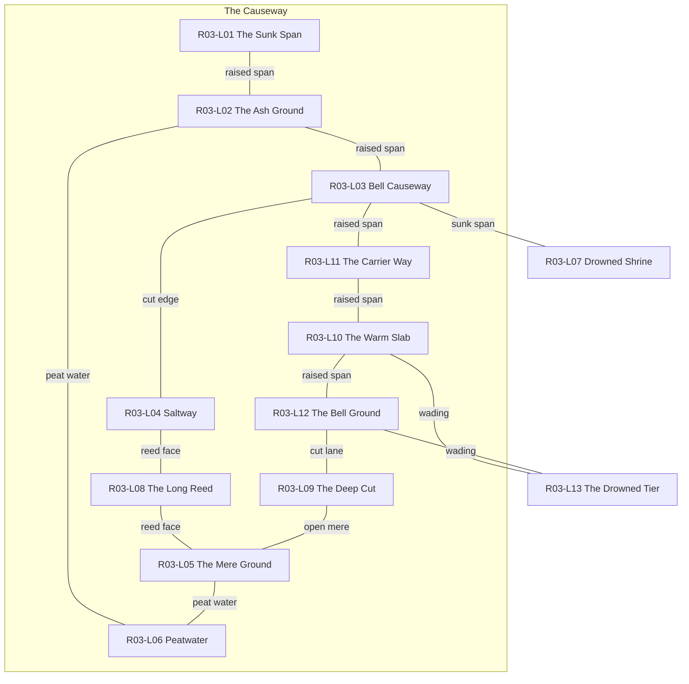

```mermaid
flowchart TD
%% Tier 4. Container the-causeway of R03: its locations, typed edges, and the destinations they reach outside it.
%% Derived by tools/mermaid_gen.py. Do not edit.
    subgraph THE_CAUSEWAY["The Causeway"]
        R03_L01["R03-L01 The Sunk Span"]
        R03_L02["R03-L02 The Ash Ground"]
        R03_L03["R03-L03 Bell Causeway"]
        R03_L04["R03-L04 Saltway"]
        R03_L05["R03-L05 The Mere Ground"]
        R03_L06["R03-L06 Peatwater"]
        R03_L08["R03-L08 The Long Reed"]
        R03_L09["R03-L09 The Deep Cut"]
        R03_L10["R03-L10 The Warm Slab"]
        R03_L11["R03-L11 The Carrier Way"]
        R03_L12["R03-L12 The Bell Ground"]
    end
    R03_L07["R03-L07 Drowned Shrine"]
    R03_L13["R03-L13 The Drowned Tier"]
    R03_L01 ---|raised span| R03_L02
    R03_L02 ---|raised span| R03_L03
    R03_L02 ---|peat water| R03_L06
    R03_L03 ---|cut edge| R03_L04
    R03_L03 ---|sunk span| R03_L07
    R03_L03 ---|raised span| R03_L11
    R03_L04 ---|reed face| R03_L08
    R03_L05 ---|peat water| R03_L06
    R03_L08 ---|reed face| R03_L05
    R03_L09 ---|open mere| R03_L05
    R03_L10 ---|raised span| R03_L12
    R03_L10 ---|wading| R03_L13
    R03_L11 ---|raised span| R03_L10
    R03_L12 ---|cut lane| R03_L09
    R03_L12 ---|wading| R03_L13
```
