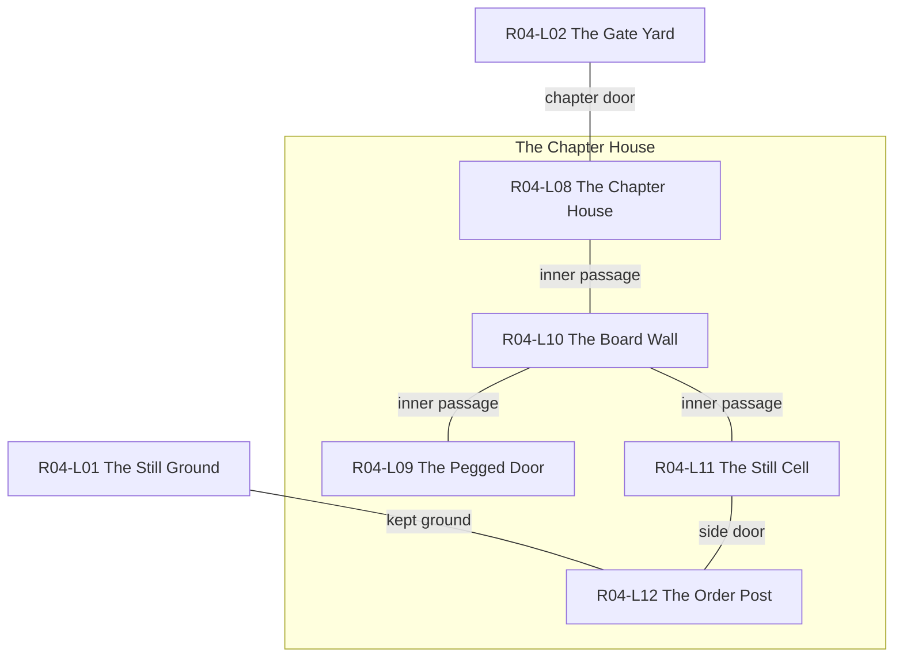

```mermaid
flowchart TD
%% Tier 4. Container the-chapter-house of R04: its locations, typed edges, and the destinations they reach outside it.
%% Derived by tools/mermaid_gen.py. Do not edit.
    subgraph THE_CHAPTER_HOUSE["The Chapter House"]
        R04_L08["R04-L08 The Chapter House"]
        R04_L09["R04-L09 The Pegged Door"]
        R04_L10["R04-L10 The Board Wall"]
        R04_L11["R04-L11 The Still Cell"]
        R04_L12["R04-L12 The Order Post"]
    end
    R04_L01["R04-L01 The Still Ground"]
    R04_L02["R04-L02 The Gate Yard"]
    R04_L01 ---|kept ground| R04_L12
    R04_L02 ---|chapter door| R04_L08
    R04_L08 ---|inner passage| R04_L10
    R04_L10 ---|inner passage| R04_L09
    R04_L10 ---|inner passage| R04_L11
    R04_L11 ---|side door| R04_L12
```
