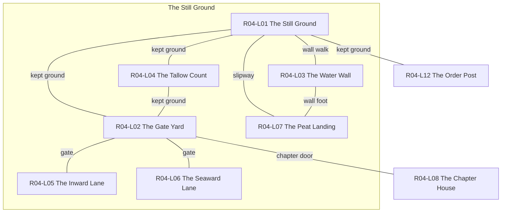

```mermaid
flowchart TD
%% Tier 4. Container the-still-ground of R04: its locations, typed edges, and the destinations they reach outside it.
%% Derived by tools/mermaid_gen.py. Do not edit.
    subgraph THE_STILL_GROUND["The Still Ground"]
        R04_L01["R04-L01 The Still Ground"]
        R04_L02["R04-L02 The Gate Yard"]
        R04_L03["R04-L03 The Water Wall"]
        R04_L04["R04-L04 The Tallow Count"]
        R04_L05["R04-L05 The Inward Lane"]
        R04_L06["R04-L06 The Seaward Lane"]
        R04_L07["R04-L07 The Peat Landing"]
    end
    R04_L08["R04-L08 The Chapter House"]
    R04_L12["R04-L12 The Order Post"]
    R04_L01 ---|kept ground| R04_L02
    R04_L01 ---|wall walk| R04_L03
    R04_L01 ---|kept ground| R04_L04
    R04_L01 ---|slipway| R04_L07
    R04_L01 ---|kept ground| R04_L12
    R04_L02 ---|gate| R04_L05
    R04_L02 ---|gate| R04_L06
    R04_L02 ---|chapter door| R04_L08
    R04_L03 ---|wall foot| R04_L07
    R04_L04 ---|kept ground| R04_L02
```
