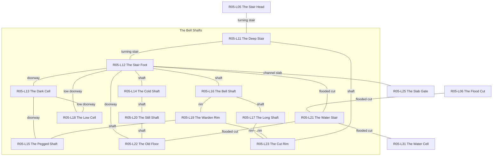

```mermaid
flowchart TD
%% Tier 4. Container the-bell-shafts of R05: its locations, typed edges, and the destinations they reach outside it.
%% Derived by tools/mermaid_gen.py. Do not edit.
    subgraph THE_BELL_SHAFTS["The Bell Shafts"]
        R05_L11["R05-L11 The Deep Stair"]
        R05_L12["R05-L12 The Stair Foot"]
        R05_L13["R05-L13 The Dark Cell"]
        R05_L14["R05-L14 The Cold Shaft"]
        R05_L15["R05-L15 The Pegged Shaft"]
        R05_L16["R05-L16 The Bell Shaft"]
        R05_L17["R05-L17 The Long Shaft"]
        R05_L18["R05-L18 The Low Cell"]
        R05_L19["R05-L19 The Warden Rim"]
        R05_L20["R05-L20 The Still Shaft"]
        R05_L21["R05-L21 The Water Stair"]
        R05_L22["R05-L22 The Old Floor"]
        R05_L23["R05-L23 The Cut Rim"]
    end
    R05_L05["R05-L05 The Stair Head"]
    R05_L06["R05-L06 The Flood Cut"]
    R05_L25["R05-L25 The Slab Gate"]
    R05_L31["R05-L31 The Water Cell"]
    R05_L05 ---|turning stair| R05_L11
    R05_L06 ---|flooded cut| R05_L21
    R05_L11 ---|turning stair| R05_L12
    R05_L12 ---|doorway| R05_L13
    R05_L12 ---|shaft| R05_L14
    R05_L12 ---|shaft| R05_L16
    R05_L12 ---|low doorway| R05_L18
    R05_L12 ---|flooded cut| R05_L21
    R05_L12 ---|doorway| R05_L22
    R05_L12 ---|channel slab| R05_L25
    R05_L13 ---|doorway| R05_L15
    R05_L13 ---|low doorway| R05_L18
    R05_L14 ---|shaft| R05_L20
    R05_L16 ---|shaft| R05_L17
    R05_L16 ---|rim| R05_L19
    R05_L17 ---|rim| R05_L23
    R05_L19 ---|shaft| R05_L15
    R05_L19 ---|rim| R05_L23
    R05_L20 ---|shaft| R05_L22
    R05_L21 ---|flooded cut| R05_L22
    R05_L21 ---|flooded cut| R05_L31
    R05_L23 ---|shaft| R05_L11
```
