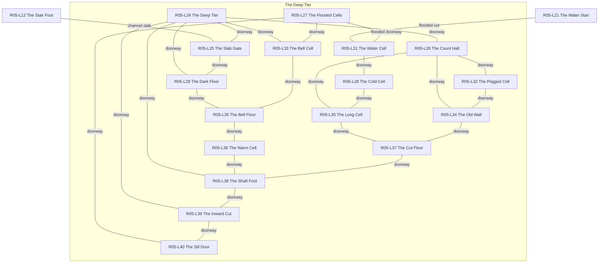

```mermaid
flowchart TD
%% Tier 4. Container the-deep-tier of R05: its locations, typed edges, and the destinations they reach outside it.
%% Derived by tools/mermaid_gen.py. Do not edit.
    subgraph THE_DEEP_TIER["The Deep Tier"]
        R05_L24["R05-L24 The Deep Tier"]
        R05_L25["R05-L25 The Slab Gate"]
        R05_L26["R05-L26 The Count Hall"]
        R05_L27["R05-L27 The Flooded Cells"]
        R05_L28["R05-L28 The Cold Cell"]
        R05_L29["R05-L29 The Dark Floor"]
        R05_L30["R05-L30 The Long Cell"]
        R05_L31["R05-L31 The Water Cell"]
        R05_L32["R05-L32 The Pegged Cell"]
        R05_L33["R05-L33 The Bell Cell"]
        R05_L34["R05-L34 The Old Wall"]
        R05_L35["R05-L35 The Bell Floor"]
        R05_L36["R05-L36 The Warm Cell"]
        R05_L37["R05-L37 The Cut Floor"]
        R05_L38["R05-L38 The Shaft Foot"]
        R05_L39["R05-L39 The Inward Cut"]
        R05_L40["R05-L40 The Sill Door"]
    end
    R05_L12["R05-L12 The Stair Foot"]
    R05_L21["R05-L21 The Water Stair"]
    R05_L12 ---|channel slab| R05_L25
    R05_L21 ---|flooded cut| R05_L31
    R05_L24 ---|doorway| R05_L25
    R05_L24 ---|doorway| R05_L26
    R05_L24 ---|doorway| R05_L29
    R05_L24 ---|doorway| R05_L33
    R05_L24 ---|doorway| R05_L38
    R05_L24 ---|doorway| R05_L39
    R05_L25 ---|doorway| R05_L29
    R05_L26 ---|doorway| R05_L30
    R05_L26 ---|doorway| R05_L32
    R05_L26 ---|doorway| R05_L34
    R05_L27 ---|flooded doorway| R05_L31
    R05_L27 ---|doorway| R05_L33
    R05_L27 ---|doorway| R05_L40
    R05_L28 ---|doorway| R05_L30
    R05_L29 ---|doorway| R05_L35
    R05_L30 ---|doorway| R05_L37
    R05_L31 ---|doorway| R05_L28
    R05_L32 ---|doorway| R05_L34
    R05_L33 ---|doorway| R05_L35
    R05_L34 ---|doorway| R05_L37
    R05_L35 ---|doorway| R05_L36
    R05_L36 ---|doorway| R05_L38
    R05_L37 ---|doorway| R05_L38
    R05_L38 ---|doorway| R05_L39
    R05_L39 ---|doorway| R05_L40
```
