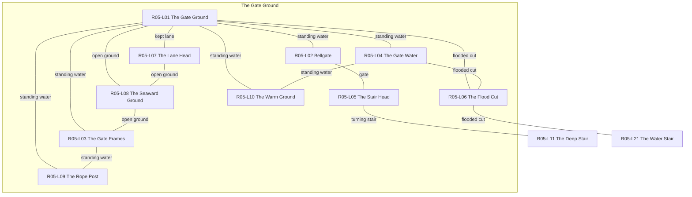

```mermaid
flowchart TD
%% Tier 4. Container the-gate-ground of R05: its locations, typed edges, and the destinations they reach outside it.
%% Derived by tools/mermaid_gen.py. Do not edit.
    subgraph THE_GATE_GROUND["The Gate Ground"]
        R05_L01["R05-L01 The Gate Ground"]
        R05_L02["R05-L02 Bellgate"]
        R05_L03["R05-L03 The Gate Frames"]
        R05_L04["R05-L04 The Gate Water"]
        R05_L05["R05-L05 The Stair Head"]
        R05_L06["R05-L06 The Flood Cut"]
        R05_L07["R05-L07 The Lane Head"]
        R05_L08["R05-L08 The Seaward Ground"]
        R05_L09["R05-L09 The Rope Post"]
        R05_L10["R05-L10 The Warm Ground"]
    end
    R05_L11["R05-L11 The Deep Stair"]
    R05_L21["R05-L21 The Water Stair"]
    R05_L01 ---|standing water| R05_L02
    R05_L01 ---|standing water| R05_L03
    R05_L01 ---|standing water| R05_L04
    R05_L01 ---|flooded cut| R05_L06
    R05_L01 ---|kept lane| R05_L07
    R05_L01 ---|open ground| R05_L08
    R05_L01 ---|standing water| R05_L09
    R05_L01 ---|standing water| R05_L10
    R05_L02 ---|gate| R05_L05
    R05_L03 ---|standing water| R05_L09
    R05_L04 ---|flooded cut| R05_L06
    R05_L04 ---|standing water| R05_L10
    R05_L05 ---|turning stair| R05_L11
    R05_L06 ---|flooded cut| R05_L21
    R05_L07 ---|open ground| R05_L08
    R05_L08 ---|open ground| R05_L03
```
