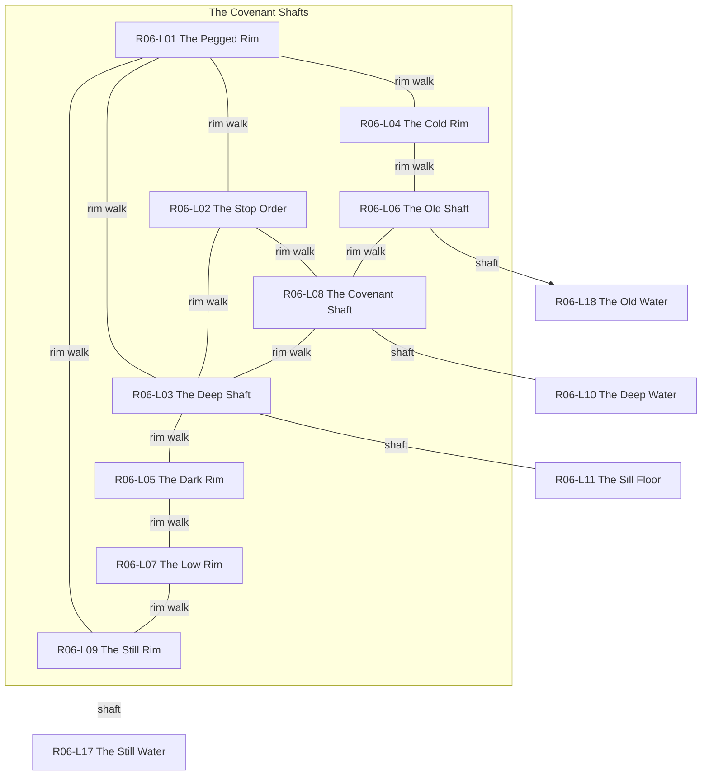

```mermaid
flowchart TD
%% Tier 4. Container the-covenant-shafts of R06: its locations, typed edges, and the destinations they reach outside it.
%% Derived by tools/mermaid_gen.py. Do not edit.
    subgraph THE_COVENANT_SHAFTS["The Covenant Shafts"]
        R06_L01["R06-L01 The Pegged Rim"]
        R06_L02["R06-L02 The Stop Order"]
        R06_L03["R06-L03 The Deep Shaft"]
        R06_L04["R06-L04 The Cold Rim"]
        R06_L05["R06-L05 The Dark Rim"]
        R06_L06["R06-L06 The Old Shaft"]
        R06_L07["R06-L07 The Low Rim"]
        R06_L08["R06-L08 The Covenant Shaft"]
        R06_L09["R06-L09 The Still Rim"]
    end
    R06_L10["R06-L10 The Deep Water"]
    R06_L11["R06-L11 The Sill Floor"]
    R06_L17["R06-L17 The Still Water"]
    R06_L18["R06-L18 The Old Water"]
    R06_L01 ---|rim walk| R06_L02
    R06_L01 ---|rim walk| R06_L03
    R06_L01 ---|rim walk| R06_L04
    R06_L01 ---|rim walk| R06_L09
    R06_L02 ---|rim walk| R06_L03
    R06_L02 ---|rim walk| R06_L08
    R06_L03 ---|rim walk| R06_L05
    R06_L03 ---|shaft| R06_L11
    R06_L04 ---|rim walk| R06_L06
    R06_L05 ---|rim walk| R06_L07
    R06_L06 ---|rim walk| R06_L08
    R06_L06 -->|shaft| R06_L18
    R06_L07 ---|rim walk| R06_L09
    R06_L08 ---|rim walk| R06_L03
    R06_L08 ---|shaft| R06_L10
    R06_L09 ---|shaft| R06_L17
```
