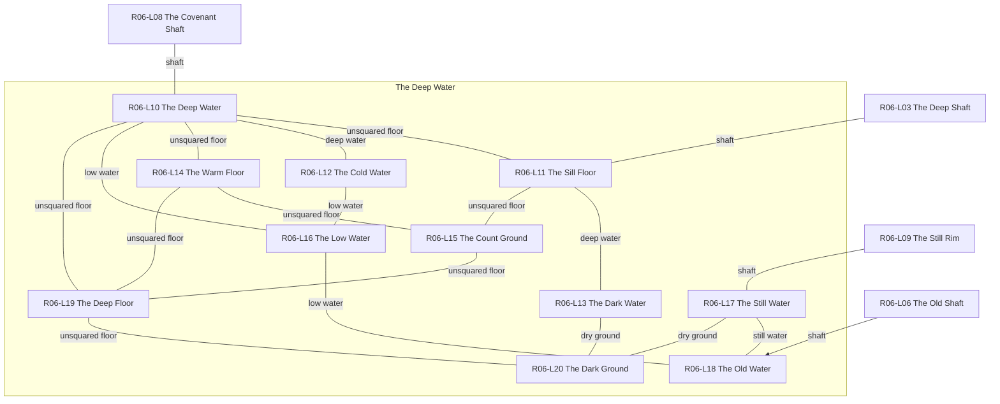

```mermaid
flowchart TD
%% Tier 4. Container the-deep-water of R06: its locations, typed edges, and the destinations they reach outside it.
%% Derived by tools/mermaid_gen.py. Do not edit.
    subgraph THE_DEEP_WATER["The Deep Water"]
        R06_L10["R06-L10 The Deep Water"]
        R06_L11["R06-L11 The Sill Floor"]
        R06_L12["R06-L12 The Cold Water"]
        R06_L13["R06-L13 The Dark Water"]
        R06_L14["R06-L14 The Warm Floor"]
        R06_L15["R06-L15 The Count Ground"]
        R06_L16["R06-L16 The Low Water"]
        R06_L17["R06-L17 The Still Water"]
        R06_L18["R06-L18 The Old Water"]
        R06_L19["R06-L19 The Deep Floor"]
        R06_L20["R06-L20 The Dark Ground"]
    end
    R06_L03["R06-L03 The Deep Shaft"]
    R06_L06["R06-L06 The Old Shaft"]
    R06_L08["R06-L08 The Covenant Shaft"]
    R06_L09["R06-L09 The Still Rim"]
    R06_L03 ---|shaft| R06_L11
    R06_L06 -->|shaft| R06_L18
    R06_L08 ---|shaft| R06_L10
    R06_L09 ---|shaft| R06_L17
    R06_L10 ---|unsquared floor| R06_L11
    R06_L10 ---|deep water| R06_L12
    R06_L10 ---|unsquared floor| R06_L14
    R06_L10 ---|low water| R06_L16
    R06_L10 ---|unsquared floor| R06_L19
    R06_L11 ---|deep water| R06_L13
    R06_L11 ---|unsquared floor| R06_L15
    R06_L12 ---|low water| R06_L16
    R06_L13 ---|dry ground| R06_L20
    R06_L14 ---|unsquared floor| R06_L15
    R06_L14 ---|unsquared floor| R06_L19
    R06_L15 ---|unsquared floor| R06_L19
    R06_L16 ---|low water| R06_L18
    R06_L17 ---|still water| R06_L18
    R06_L17 ---|dry ground| R06_L20
    R06_L19 ---|unsquared floor| R06_L20
```
